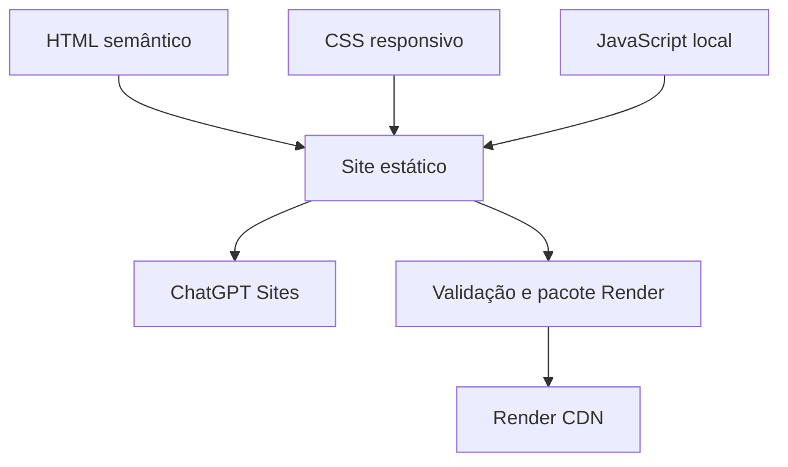

# Arquitetura

## Visão geral

O site é uma aplicação estática buildless. O diretório `dist/` contém exatamente os arquivos necessários para publicação, sem etapa de compilação nem dependências no navegador.

## Camadas

### Conteúdo

`dist/index.html` concentra a página principal e suas seções comerciais. Rotas institucionais têm documentos independentes para permitir indexação direta.

### Apresentação

`dist/styles.css` contém tokens da marca, layout responsivo, estados interativos, animações e regras de acessibilidade.

### Comportamento

`dist/app.js` controla navegação móvel, diagnóstico, calculadora, formulários, WhatsApp, galeria, analytics e assistente VOAÍ.

### Assets

`dist/assets/` mantém imagens otimizadas e logos. Imagens simuladas devem continuar identificadas como simulação; logos de marketplaces não implicam parceria ou homologação.

### Entrega

O ChatGPT Sites publica `dist/` diretamente. No Render, `npm run render:verify` valida a fonte e gera `render-dist/`, um artefato descartável com os mesmos arquivos públicos e um endpoint de saúde. Essa separação mantém dados do deploy fora da fonte oficial.

## Decisões técnicas

- Sem framework para reduzir transferência, dependências e tempo de inicialização.
- Sem backend enquanto não houver armazenamento e política de dados aprovados.
- Sem login porque o site é público e institucional.
- Chatbot determinístico para impedir respostas fora das regras comerciais publicadas.
- Degradação segura do WhatsApp: enquanto o número estiver pendente, a mensagem é copiada e nenhum contato fictício é usado.

## Evolução futura

Backend, CRM, analytics, pixels, chat com IA externa e consulta definitiva de cobertura devem ser tratados como integrações separadas, com consentimento, observabilidade, limites, tratamento de erro e revisão de LGPD.
